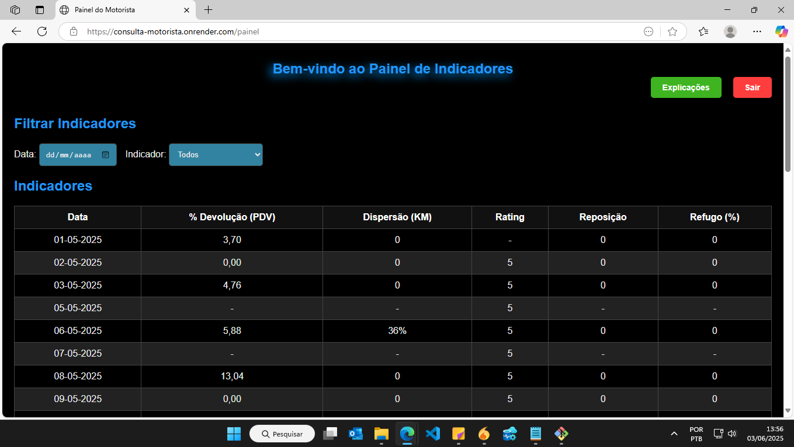
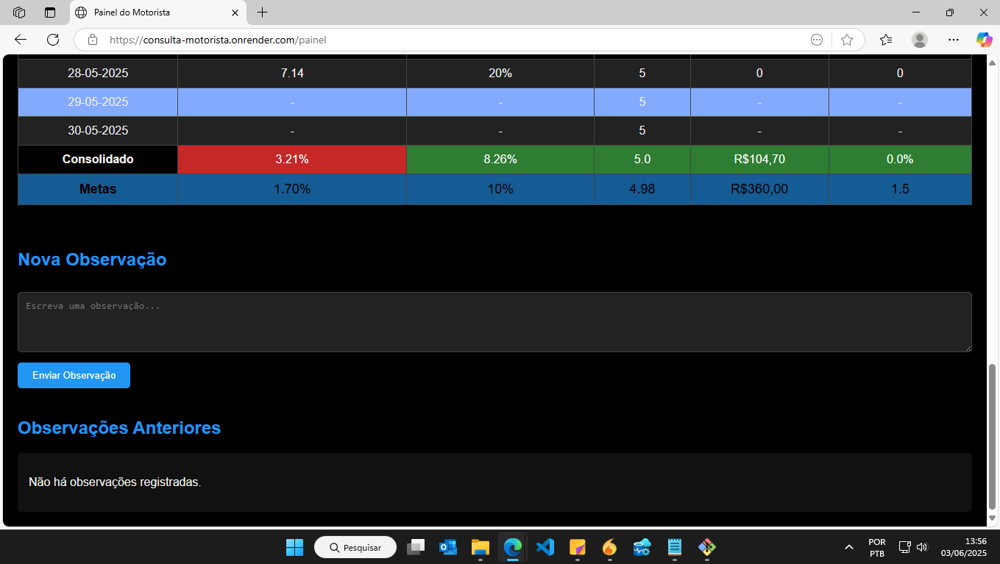
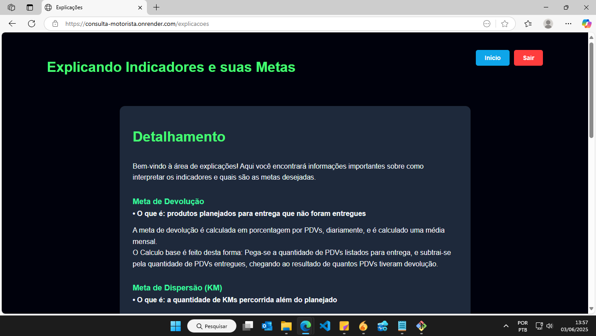
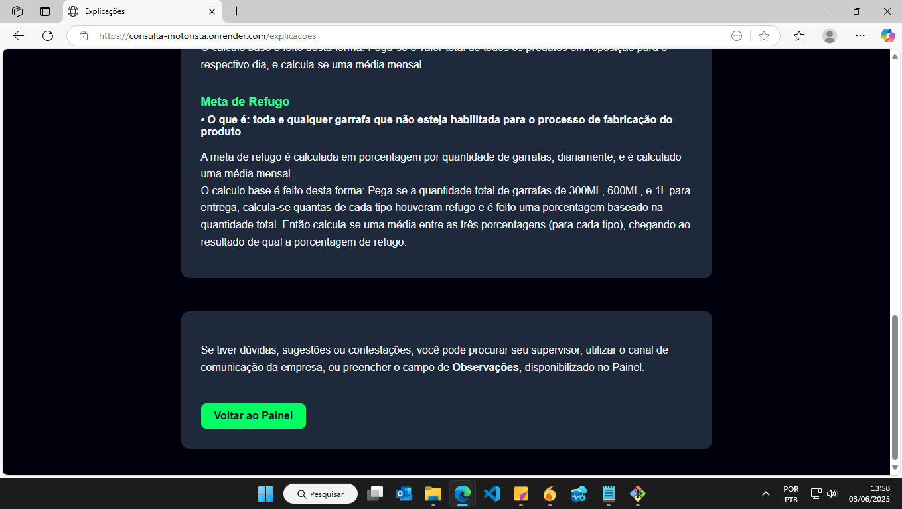
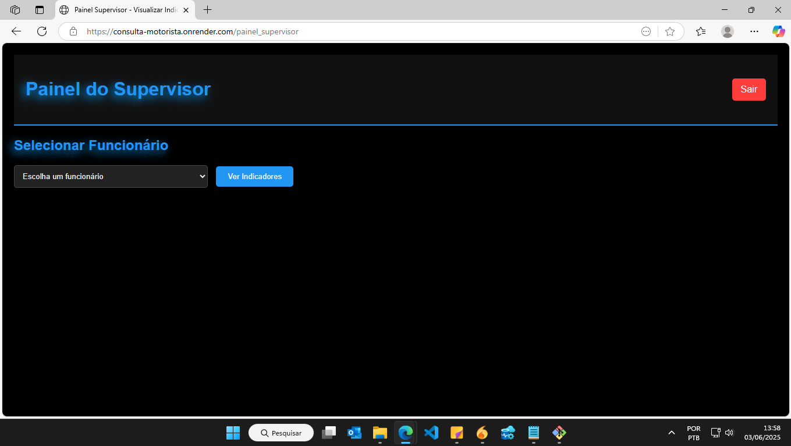
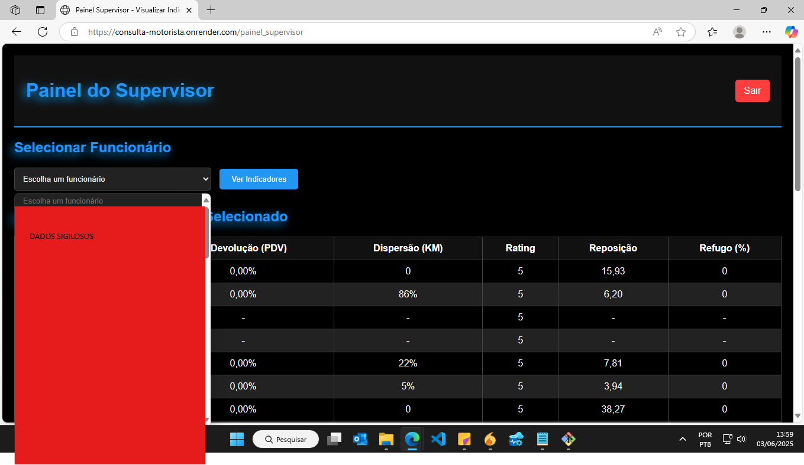

# 📊 Consulta de Indicadores

Aplicação web desenvolvida com **Python (Flask)** e **SQL Server (Azure)** que permite que **funcionários** e **gerentes** acessem indicadores de desempenho por meio de uma interface segura, moderna e responsiva. A autenticação é feita com **ID** e **senha individual**, e os dados são apresentados com filtros interativos e visualização clara.

## 🖥️ Funcionalidades

- Login individual para **funcionários** e **gerentes**  
- Visualização de indicadores com **média automática**  
- Filtros por **data** e **tipo de indicador**  
- Envio e exibição de observações  
- Interface com **tema escuro e azul**, design moderno e limpo  
- **Design responsivo**, funcionando perfeitamente em qualquer dispositivo (desktop, tablet e celular)  
- Interações assíncronas com JavaScript  

## 📦 Tecnologias Utilizadas

- **Backend:** Python + Flask  
- **Frontend:** HTML, CSS, JavaScript  
- **Banco de Dados:** SQL Server hospedado no **Microsoft Azure**  
- **Deploy:** [Render](https://render.com/)  
- **Conexão segura:** Variável de ambiente `DATABASE_URL` (armazenada como chave secreta no Render)

## 🌐 Deploy com Render

A aplicação está hospedada no [Render](https://render.com/) com:

- Banco de dados em **SQL Server no Azure**  
- String de conexão protegida como **variável de ambiente secreta (`DATABASE_URL`)**  
- Deploy automático via GitHub  
- Configuração pronta com `requirements.txt` e `gunicorn`

## 🧠 JavaScript no Projeto

JavaScript é utilizado para:

- Envio de formulários de observações sem recarregar a página  
- Experiência dinâmica no painel  
- Filtros e atualizações de interface sem recarga  

Exemplo de envio assíncrono:

```javascript
document.getElementById('obsForm').addEventListener('submit', async (event) => {
    event.preventDefault();
    const obs = document.getElementById('observacao').value;
    const res = await fetch('/enviar_observacao', {
        method: 'POST',
        headers: { 'Content-Type': 'application/json' },
        body: JSON.stringify({ observacao: obs }),
    });
    if (res.ok) {
        location.reload();
    }
});
```

## 📅 Filtros por Data e Indicador

A interface permite que o **funcionário** ou **gerente** filtre os dados por:

- Intervalo de **datas**  
- Tipo de **indicador**

Esses filtros tornam a visualização mais prática e direcionada.

## 🖼️ Prints da Interface

> Abaixo, print de algumas **telas da interface**:

```markdown







```

---
